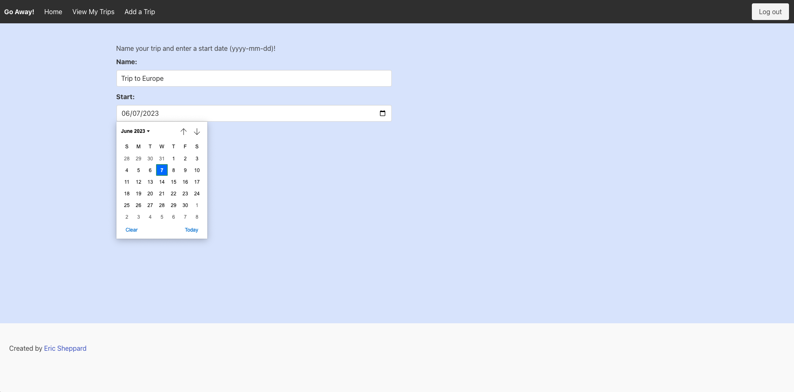
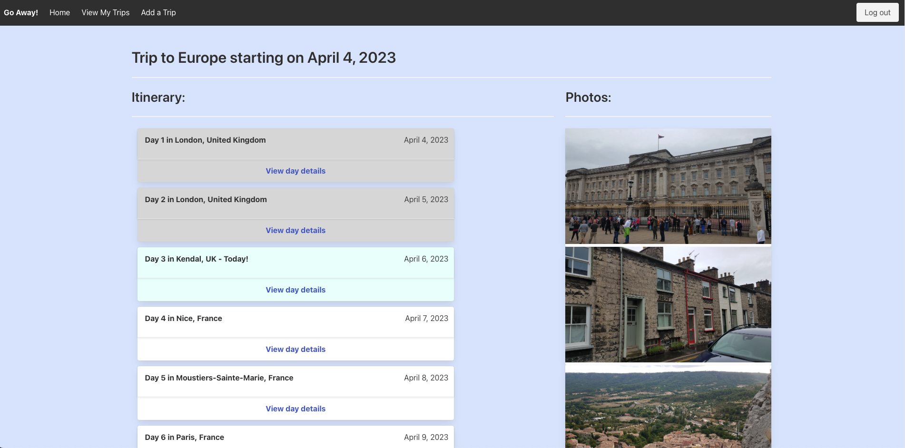
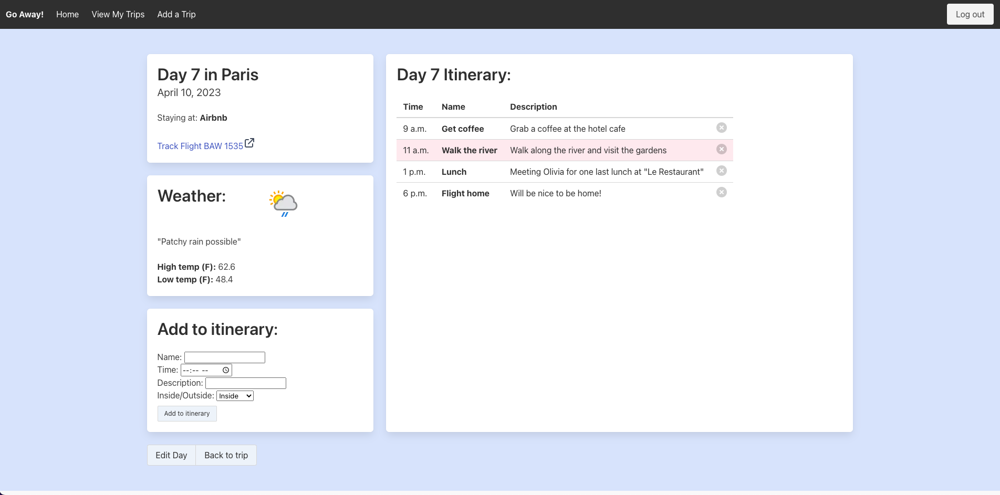
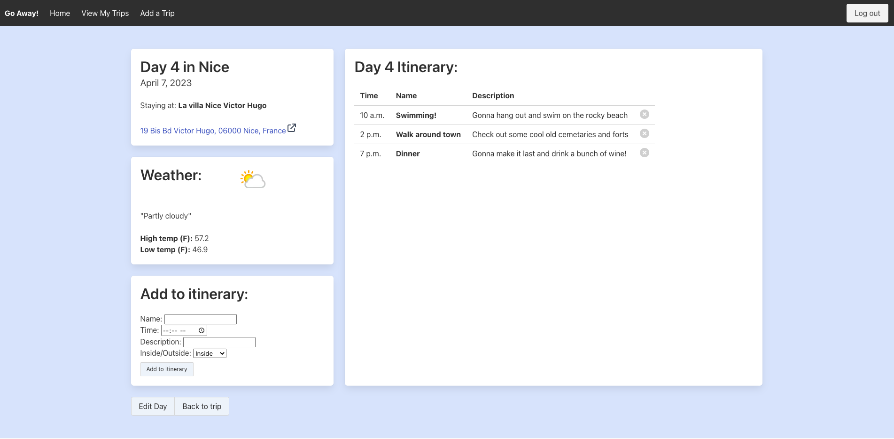

# Go Away!

## Overview
---
Go away is a travel itinerary planning app.  It is designed to help with all the planning and logistics that go into planning a vacation!  From where to go, to where to stay, to what to do, to the local weather, you can plan your whole trip day by day.  The app will automatically update the weather forecast and provide links to maps for loding and flight tracking.  It also serves as a place to save photos of your trips!

## Screen Shots
---
Home Page:

Create Trip:

Trip View:

Blank Day:

Day Example One:

Day Example Two:

## Technologies used
---
    HTML
    Javascript
    CSS
    Django
    Python
    

## User Stories
---
    As a user I want the ability to sign up
    As a user I want the ability to sign in
    As a user I want the ability to sign out
    As a user I want the ability to choose a timeframe for my trip
    As a user I want the ability to choose a location for each day
    As a user I want the ability to choose a place of lodging for each day
    As a user I want the ability to choose a method of transportation for each day
    As a user I want the ability to add activities for each day
    As a user I want the ability to upload photos of my trip
    As a user I want the ability to edit trip details
    As a user I want the ability to delete my trip
    
## Wireframes
---

## ERD
---
